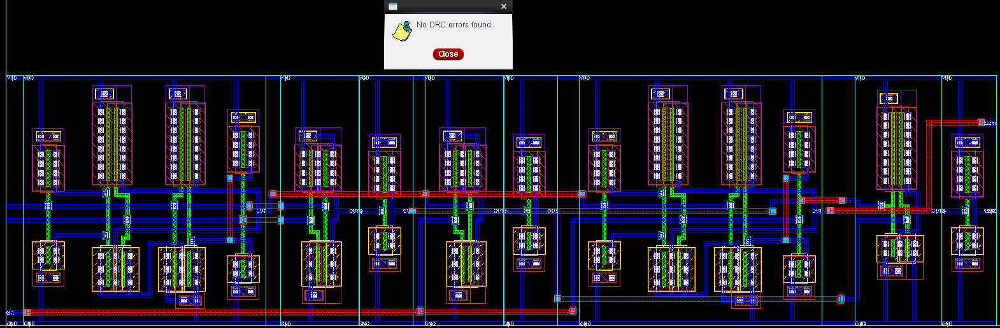
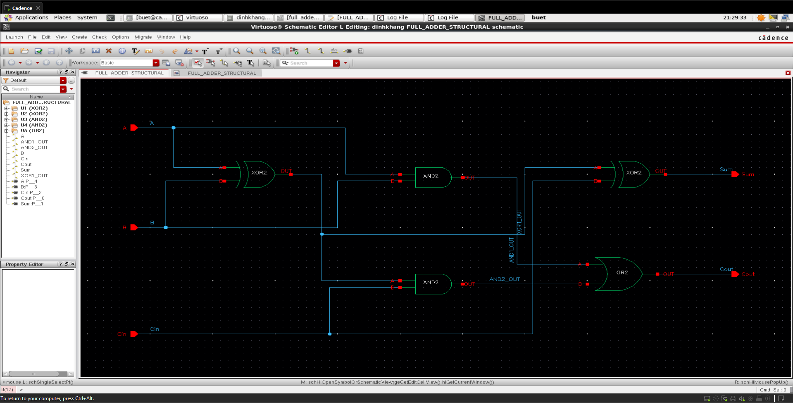
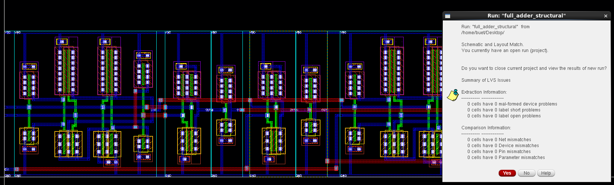
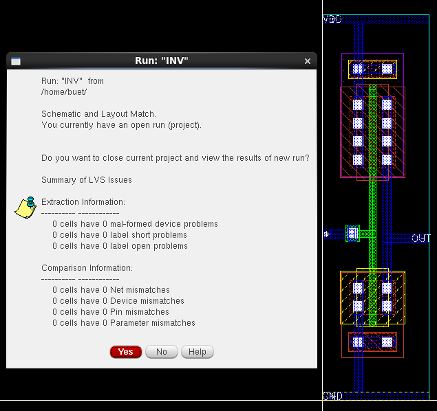
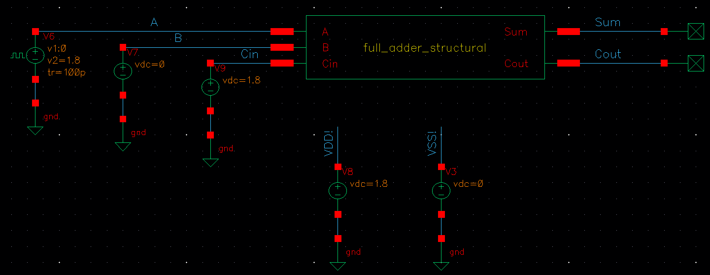
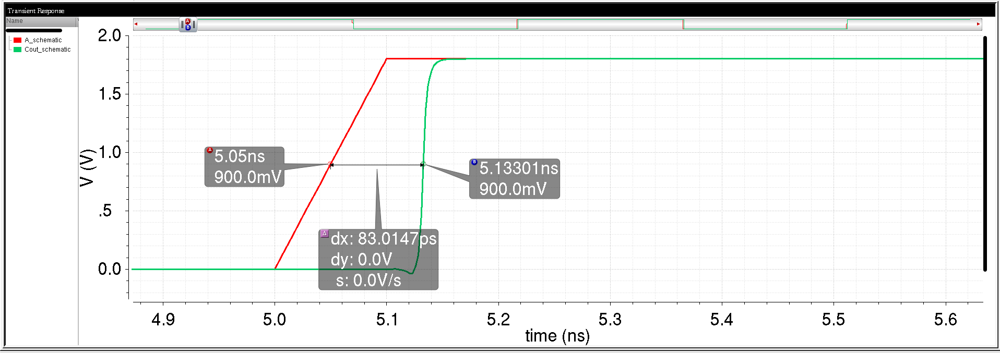
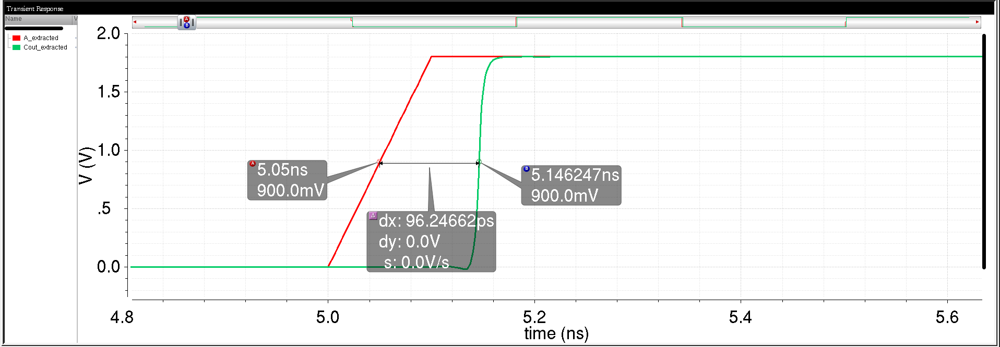
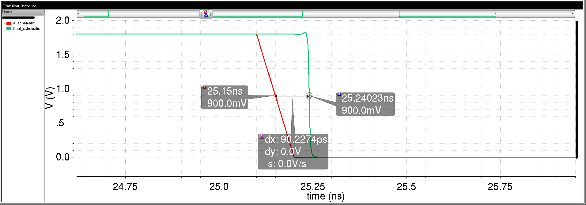
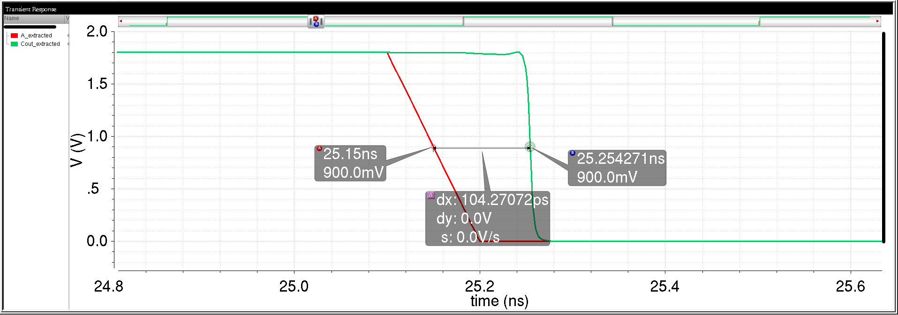

# CMOS Logic Cell Design, Layout and Post-Layout Analysis

Academic project documentation covering transistor characterization, CMOS logic design, custom layout, physical verification, and parasitic-aware transient simulation using Cadence Virtuoso and GPDK090.

**Focus:** cell-level layout, DRC/LVS, RC extraction, and schematic versus post-layout timing comparisons.

[Read the report — PDF](doc/CMOS_Logic_Layout_Report.pdf) · [Download the report — Word](doc/CMOS_Logic_Layout_Report.docx)

*Full-adder layout and DRC result, reproduced from Lab 5-2 of the group report.*

## Project overview

The project follows a sequence of laboratory exercises in CMOS circuit design. It explores how transistor sizing, circuit structure, layout, and extracted parasitics affect the behavior of basic logic cells and a 1-bit full adder.

| Report section | Work documented |
| --- | --- |
| Labs 1-1 and 1-2 | NMOS/PMOS DC characteristics, threshold voltage, on/off currents, and device behavior |
| Labs 2-1 and 2-2 | INV, NAND2, NOR2, AND2, OR2, XOR2, transmission gates, and a CMOS D flip-flop |
| Labs 3-1 and 3-2 | Transient delay measurements and DFF setup, hold, and clock-to-Q investigations |
| Lab 4-1 | CMOS logic-gate power analysis |
| Lab 4-2 | Structural Verilog full adder, Vivado functional simulation, and Verilog import into Virtuoso |
| Lab 5-1 | Custom layout and DRC for logic cells, DFF, and full adder |
| Lab 5-2 | LVS, RC extraction, and schematic versus post-layout simulation |

## Tools and technology

- **Cadence Virtuoso:** schematic, symbol, and layout creation; simulation setup through ADE.
- **Spectre and ViVA:** circuit simulation, waveform inspection, and timing measurements.
- **Assura / RCX:** physical verification and parasitic RC extraction as documented in the report.
- **Vivado:** functional simulation of the structural Verilog full adder in Lab 4-2.
- **GPDK090:** educational 90 nm process design kit.
- **Linux:** laboratory design environment.

## Design workflow

1. Characterize NMOS and PMOS devices and construct CMOS gate schematics.
2. Verify circuit behavior with transient simulation and measure timing.
3. Build cell layouts, connect supply rails and signals, and address DRC violations.
4. Compare layout connectivity against the schematic using LVS.
5. Extract parasitic resistance and capacitance and simulate the extracted view.
6. Compare schematic and extracted waveforms under the corresponding test conditions.

The full adder uses two XOR gates, two AND gates, and one OR gate. Lab 4-2 documents a simulation covering all eight input combinations and import of the structural design into Virtuoso.

Full-adder schematic and verification evidence

*Imported schematic from Lab 4-2, included as part of the group project.*

*The report screenshot identifies the full-adder run and displays a schematic/layout match with zero listed net, device, pin, or parameter mismatches.*

*Inverter LVS result from Lab 5-2.*

## Selected results: full-adder timing

The following values come from the **Lab 5-2 full-adder timing table**. They represent the average of rising-output and falling-output propagation delays, measured at 50% of the supply voltage.

| Signal path | Schematic average (ps) | Extracted average (ps) |
| --- | ---: | ---: |
| A → SUM | 73.053 | 83.930 |
| B → SUM | 72.954 | 85.099 |
| Cin → SUM | 33.404 | 38.655 |
| Cin → COUT | 44.882 | 51.257 |
| **A → COUT** | **86.621** | **100.259** |

**A → COUT has the largest average delay among these five measured paths.** Its average increases by **13.638 ps (15.74%)** after extraction. This comparison illustrates the timing cost of the extracted parasitics; it is not a timing-improvement result.

For the illustrated A → COUT test, the report shows VDD = 1.8 V, B = 0 V, Cin = 1.8 V, and an A input pulse from 0 to 1.8 V with a 40 ns period, 20 ns pulse width, 5 ns delay, and 100 ps rise/fall settings. The measurement threshold is 0.9 V. Process corner, temperature, and external output loading are not fully specified in the selected evidence, so these values should be interpreted within the documented experiment.

*Testbench for the A → COUT comparison.*

| A → COUT transition | Schematic (ps) | Extracted (ps) |
| --- | ---: | ---: |
| Rising output | 83.01470 | 96.24662 |
| Falling output | 90.22740 | 104.27072 |
| Average | 86.62105 | 100.25867 |

The largest individual transition delay in this table is **104.271 ps**. The **100.259 ps** figure is the average for the path, not its maximum transition delay.

View the timing measurement screenshots

*Schematic rising-output delay: 83.01470 ps.*

*Extracted rising-output delay: 96.24662 ps.*

*Schematic falling-output delay: 90.22740 ps.*

*Extracted falling-output delay: 104.27072 ps.*

## Repository contents

| Location | Contents |
| --- | --- |
| `README.md` | Project overview, selected evidence, and report links |
| `doc/CMOS_Logic_Layout_Report.pdf` | Full Vietnamese report in PDF format |
| `doc/CMOS_Logic_Layout_Report.docx` | Word version of the report |
| `images/` | Selected original screenshots extracted from the report |

## Contributions and acknowledgments

This is a two-member academic group project by **Phùng Gia Huy** and **Chống Định Khang**.

- **Phùng Gia Huy:** Primary contributor to transistor characterization, CMOS circuit design, timing analysis, layout, DRC/LVS verification, and post-layout simulation. Maintains this repository and its documentation.
- **Chống Định Khang:** Led the Lab 4 work on CMOS power analysis and structural Verilog full-adder simulation and import into Virtuoso.

The report combines both members’ contributions. Instructor: **PGS. TS. Võ Minh Huân**. Course: **Thực tập thiết kế vi mạch tích hợp tương tự**, semester 1, academic year 2025–2026.

## Scope and reproducibility

This repository contains academic project documentation and report screenshots. Results are recorded laboratory results; the design has not been rerun as part of preparing this portfolio. Standalone design databases, testbenches, simulation scripts, raw logs, and PDK files are not included, so this repository does not provide a complete reproducible simulation environment.

Timing here is based on transistor-level transient simulation. The project does not claim a complete block-level RTL-to-GDSII flow, dedicated static timing analysis, or timing signoff across process, voltage, and temperature corners. Verilog import is described as schematic generation from a structural design.
